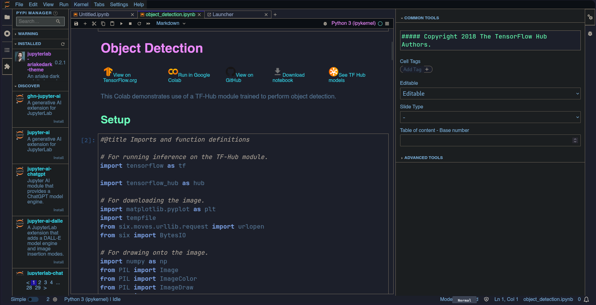

# Jupyterlab Ariake Dark Theme

---

**An ariake dark palette based JupyterLab theme extension.**

[![updatebadge]][update] [![pypibadge]][pypi] [![mitbadge]][license][![ci-badge]][ci] [![emailbadge]][email]

[update]: https://github.com/eduardotlc/jupyterlab_ariakedark_theme/commits/master/
[license]: https://opensource.org/licenses/mit
[pypi]: https://pypi.org/project/jupyterlab-ariakedark-theme/
[pypibadge]: https://img.shields.io/pypi/v/jupyterlab_ariakedark_theme.svg?logo=python&logoColor=yellow&color=7e7edd&style=for-the-badge
[ci-badge]: https://img.shields.io/github/actions/workflow/status/eduardotlc/jupyterlab_ariakedark_theme/build.yml?style=for-the-badge&logo=github&logoColor=de97f2&color=68f1ad
[ci]: https://github.com/eduardotlc/jupyterlab_ariakedark_theme/actions/workflows/build.yml
[email]: mailto:eduardotcampos@hotmail.com
[emailbadge]: https://img.shields.io/badge/Email-7e7edd?style=for-the-badge&logo=gmail
[materialdarkerbadge]: https://img.shields.io/badge/Material_Darker-6363ab?style=for-the-badge&logo=jupyter
[materialdarker]: https://github.com/eduardotlc/jupyterlab_materialdarker_theme
[midnightseabadge]: https://img.shields.io/badge/Midnight_Sea-a571f4?style=for-the-badge&logo=jupyter
[midnightsea]: https://github.com/eduardotlc/jupyterlab_midnightsea_theme
[mitbadge]: https://img.shields.io/badge/License-MIT-9aefea?style=for-the-badge&logo=gitbook
[updatebadge]: https://img.shields.io/badge/Updated-Oct._2025-93ddfb?style=for-the-badge&logo=googlecalendar



## requirements

- jupyterlab >= 4.0.0

## install

to install the extension, execute:

```bash
pip install jupyterlab_ariakedark_theme
```

to check the installation, execute:

```bash
jupyter labextension list
```

## uninstall

to remove the extension, execute:

```bash
pip uninstall jupyterlab_ariakedark_theme
```

## contributing

to make personal customizations to the theme, edit the [variables.css](./style/variables.css) file, and then run the development install steps listed bellow.

feel free to make [pending](./TODO.md) or other optimizations and pull requests, this theme is still under development and any contribution is very much appreciated.

### development install

> [!NOTE]
> You will need nodejs to build the extension package.

the `jlpm` command is jupyterlab's pinned version of
[yarn](https://yarnpkg.com/) that is installed with jupyterlab. you may use
`yarn` or `npm` in lieu of `jlpm` below.

- clone the repo to your local environment:

```bash
git clone https://github.com/eduardotlc/jupyterlab_ariakedark_theme
```

- change directory to the jupyterlab_ariakedark_theme directory:

```bash
cd jupyterlab_ariakedark_theme
```

- install package in development mode:

```bash
pip install -ve "."
```

- link your development version of the extension with jupyterlab:

```bash
jupyter labextension develop . --overwrite
```

- rebuild extension typescript source after making changes:

```bash
jlpm build
```

you can watch the source directory and run jupyterlab at the same time in different terminals to watch for changes in the extension's source and automatically rebuild the extension.

- watch the source directory in one terminal, automatically rebuilding when needed:

```bash
jlpm watch
```

- run jupyterlab in another terminal:

```bash
jupyter lab
```

with the watch command running, every saved change will immediately be built locally and available in your running jupyterlab. refresh jupyterlab to load the change in your browser (you may need to wait several seconds for the extension to be rebuilt).

by default, the `jlpm build` command generates the source maps for this extension to make it easier to debug using the browser dev tools. To also generate source maps for the JupyterLab core extensions, you can run the following command:

```bash
jupyter lab build --minimize=False
```

### Development uninstall

```bash
pip uninstall jupyterlab_ariakedark_theme
```

In development mode, you will also need to remove the symlink created by `jupyter labextension develop`
command. To find its location, you can run `jupyter labextension list` to figure out where the `labextensions`
folder is located. Then you can remove the symlink named `jupyterlab_ariakedark_theme` within that folder.

## Other themes

See my others Jupyter Lab themes

[![materialdarkerbadge]][materialdarker]

[![midnightseabadge]][midnightsea]
